# High-Level Design (HLD)
## EDUTrack - Internal AI Learning & Training Platform

---

## Document Control
| Version | Date | Author | Reviewer | Notes |
|---------|------|--------|----------|-------|
| 0.1     | 2025-11-26 | Solution Architect | | Draft |
| 1.0     | 2025-11-26 | Solution Architect | CTO, Security Architect, Engineering Lead | Baseline |

## Approvals
| Name | Role | Stakeholder ID | Signature | Date |
|------|------|----------------|-----------|------|
| TBD | Solution Architect | STK-014 | | |
| TBD | Chief Technology Officer | STK-002 | | |
| TBD | Security Architect | STK-027 | | |
| TBD | Engineering Lead | STK-015 | | |
| TBD | Product Owner | STK-012 | | |

---

## Table of Contents

1. [Executive Summary](#1-executive-summary)
2. [Architectural Drivers](#2-architectural-drivers)
3. [Architecture Overview](#3-architecture-overview)
4. [Architecture Views](#4-architecture-views)
5. [Component Catalogue](#5-component-catalogue)
6. [Data Design Summary](#6-data-design-summary)
7. [Integration Architecture](#7-integration-architecture)
8. [Security Architecture](#8-security-architecture)
9. [Performance & Scalability](#9-performance--scalability)
10. [Operational Considerations](#10-operational-considerations)
11. [Deployment Model](#11-deployment-model)
12. [Architecture Decision Records](#12-architecture-decision-records)
13. [Governance & Traceability](#13-governance--traceability)
14. [Appendices](#14-appendices)

---

## 1. Executive Summary

### 1.1 Purpose

This High-Level Design (HLD) document provides the comprehensive architecture blueprint for the EDUTrack Internal AI Learning & Training Platform. It defines the system architecture, component design, integration patterns, security controls, and deployment strategy that will guide detailed design (LLD) and implementation activities.

**Intended Audience:**
- Solution Architects and Technical Leads
- Development Teams (Frontend, Backend, DevOps, Data)
- Security and Compliance Teams
- Operations and Support Teams
- Product Owner and Stakeholders

### 1.2 Scope

This HLD covers the complete EDUTrack platform including:
- Web application (React frontend, Python/FastAPI backend)
- AI/ML components (Azure OpenAI integration, content generation pipeline)
- Data storage and processing (Azure SQL, Cosmos DB, Blob Storage)
- Integration services (SharePoint, Confluence, GitHub, Microsoft Learn)
- Authentication and authorization (Azure AD/Entra ID)
- Monitoring, logging, and observability infrastructure
- Deployment and operational model

### 1.3 Document References

| Document | Location | Purpose |
|----------|----------|---------|
| Business Requirements (BRD) | `docs/requirements/BRD.md` | Business objectives, scope, stakeholders |
| Product Requirements (PRD) | `docs/requirements/PRD.md` | Product features, user stories, acceptance criteria |
| System Requirements (SRS) | `docs/requirements/SRS.md` | Functional requirements, use cases, data specifications |
| Non-Functional Requirements (NFR) | `docs/requirements/NFR.md` | Quality attributes, performance targets, compliance |
| Requirements Traceability Matrix (RTM) | `docs/requirements/RTM.md` | End-to-end traceability |
| Threat Model | `docs/design/threat-model.md` | Security threat analysis and controls |
| Data Architecture | `docs/design/data-architecture.md` | Data models, flows, governance |
| API Specifications | `docs/design/api-specs/` | API contracts and interface definitions |
| Epic/Feature Backlog | `backlog/` | Delivery roadmap and feature decomposition |

---

## 2. Architectural Drivers

### 2.1 Business Context

EDUTrack addresses critical organizational challenges in employee training and skill development:

**Business Drivers:**
- **Content Creation Efficiency:** Reduce training content creation from 50 hours to <15 hours per module (70% reduction) - *BRD-OBJ-01*
- **Scale Content Production:** Increase from 60 to 120+ modules per year - *BRD-OBJ-02*
- **Personalized Learning:** Deliver personalized learning paths to all 10,000 employees - *BRD-OBJ-03*
- **User Adoption:** Achieve 85% monthly active users (8,500 employees) - *BRD-OBJ-05*
- **Compliance Excellence:** Achieve 98% mandatory training completion rate - *BRD-OBJ-07*
- **AI Governance:** Maintain >95% SME approval rate for AI-generated content - *BRD-OBJ-12*

**Strategic Alignment:**
- Digital Transformation: Demonstrates Azure AI capabilities at scale
- Operational Excellence: 70% reduction in training costs
- Employee Experience: Personalized, just-in-time learning
- Innovation Leadership: Builds internal AI/ML expertise

### 2.2 Key Constraints

| Constraint | Description | Impact | Reference |
|------------|-------------|--------|-----------|
| **Budget** | Total investment capped at $1.07M | Technology and resource selection | BRD Section 4.4 |
| **Timeline** | MVP delivery by Q2 2026 (6 months from approval) | Phased feature delivery | BRD Section 10.1 |
| **Azure-Only** | Must use approved Azure services only | No AWS/GCP/third-party cloud | BRD-CONST-Tech |
| **Data Residency** | All data within corporate Azure tenant | No public SaaS; EU/US regions | SEC-DATA-008 |
| **Performance** | <20s content generation; <500ms search; 99.9% uptime | Architecture must support targets | PERF-LAT-*, AVAIL-001 |
| **Compliance** | GDPR, ISO 27001, 7-year audit retention | Privacy by design; audit trails | COMP-001 to COMP-010 |
| **Browser Support** | Chrome, Edge, Safari, Firefox (latest 2 versions) | No native mobile apps in Phase 1 | BRD-CONST-Tech-5 |

### 2.3 Key Assumptions

| ID | Assumption | Category | Validation Method |
|----|------------|----------|-------------------|
| ASM-001 | Azure OpenAI service remains available with <50% price fluctuation | Technology | Monitor Azure pricing |
| ASM-002 | 20+ SMEs available 4-6 hours/week for content review | Resource | Manager commitments |
| ASM-003 | Modern browsers support required features (WebSocket, ES6+) | Technology | Compatibility testing |
| ASM-004 | Corporate network supports 10,000 concurrent HTTPS connections | Infrastructure | Network capacity testing |
| ASM-005 | SharePoint/Confluence/GitHub APIs maintain backward compatibility | Integration | API version monitoring |
| ASM-006 | Azure AD groups and roles can be leveraged for RBAC | Security | Azure AD configuration |

### 2.4 Quality Attribute Priorities

| Priority | Quality Attribute | NFR Reference | Target |
|----------|-------------------|---------------|--------|
| 1 | Security | SEC-* (30 NFRs) | Zero data breaches; OWASP ASVS Level 2 |
| 2 | Performance | PERF-* (23 NFRs) | <20s generation; <500ms search (P95) |
| 3 | Availability | AVAIL-* (10 NFRs) | 99.9% uptime; <30min MTTR |
| 4 | Scalability | PERF-TH-* | 10,000 concurrent users; 1M documents |
| 5 | Maintainability | MAINT-* (10 NFRs) | >80% code coverage; modular architecture |
| 6 | Usability | ACCESS-* (10 NFRs) | WCAG 2.1 AA; <1hr learner training |
| 7 | Compliance | COMP-* (10 NFRs) | GDPR; ISO 27001; 7-year retention |

---

## 3. Architecture Overview

### 3.1 System Context Diagram

```mermaid
graph TB
    subgraph Users["Users"]
        Learner["👤 Learner<br/>10,000 employees"]
        Manager["👤 Manager<br/>1,200 managers"]
        SME["👤 SME Reviewer<br/>200+ experts"]
        Admin["👤 L&D Admin<br/>100 staff"]
    end
    
    subgraph EDUTrack["EDUTrack Platform"]
        Platform["🎓 EDUTrack<br/>AI-Powered Learning Platform"]
    end
    
    subgraph External["External Systems"]
        AzureAD["🔐 Azure AD<br/>Identity Provider"]
        OpenAI["🤖 Azure OpenAI<br/>Content Generation"]
        SharePoint["📁 SharePoint<br/>Document Source"]
        Confluence["📝 Confluence<br/>Wiki Source"]
        GitHub["💻 GitHub<br/>Code Docs Source"]
        MSLearn["📚 Microsoft Learn<br/>External Catalog"]
    end
    
    Learner -->|HTTPS| Platform
    Manager -->|HTTPS| Platform
    SME -->|HTTPS| Platform
    Admin -->|HTTPS| Platform
    
    Platform -->|OAuth 2.0| AzureAD
    Platform -->|REST API| OpenAI
    Platform -->|Graph API| SharePoint
    Platform -->|REST API| Confluence
    Platform -->|REST API| GitHub
    Platform -->|REST API| MSLearn
```

### 3.2 Solution Architecture Overview

### 3.3 Technology Stack Summary

| Layer | Technology | Version | Purpose |
|-------|------------|---------|---------|
| **Frontend** | React | 18.x | Single Page Application |
| **Frontend** | TypeScript | 5.x | Type-safe JavaScript |
| **Frontend** | Tailwind CSS | 3.x | Utility-first styling |
| **Backend** | Python | 3.11+ | Backend API development |
| **Backend** | FastAPI | 0.100+ | High-performance REST API framework |
| **Backend** | Pydantic | 2.x | Data validation and settings |
| **Database** | Azure SQL Database | Latest | Relational data (users, content, learning) |
| **Database** | Azure Cosmos DB | Latest | Audit logs, analytics (NoSQL) |
| **Storage** | Azure Blob Storage | Latest | Documents, media, exports |
| **Search** | Azure AI Search | Latest | Semantic search with embeddings |
| **Cache** | Azure Redis Cache | Latest | Session state, query caching |
| **AI/ML** | Azure OpenAI (GPT-4) | Latest | Content generation, skill tagging |
| **Identity** | Azure AD (Entra ID) | Latest | SSO, RBAC, user directory |
| **Gateway** | Azure API Management | Latest | API gateway, rate limiting |
| **WAF** | Azure Front Door | Latest | CDN, WAF, global load balancing |
| **Monitoring** | Application Insights | Latest | APM, distributed tracing |
| **Secrets** | Azure Key Vault | Latest | Secrets management |
| **CI/CD** | Azure Pipelines | Latest | Build and deployment automation |
| **IaC** | Bicep | Latest | Infrastructure as Code |

---

## 4. Architecture Views

### 4.1 Logical View

The logical view shows the major functional components and their responsibilities.

#### 4.1.1 Component Responsibilities

| Component | Responsibility | Key Features |
|-----------|---------------|--------------|
| **Learner Portal** | End-user learning experience | Dashboard, course player, search, progress tracking |
| **Manager Portal** | Team management and analytics | Team skill heatmaps, compliance tracking, assignments |
| **Admin Console** | Platform administration | User/role management, configuration, content lifecycle |
| **SME Review UI** | Content validation workflow | Side-by-side review, inline editing, approval actions |
| **Authentication** | Identity and access management | Azure AD SSO, token management, session handling |
| **Content Management** | Content lifecycle | Ingestion, generation, versioning, publishing |
| **Learning Management** | Learning paths and tracking | Personalization, progress, skill profiles |
| **Analytics** | Reporting and insights | Dashboards, compliance reports, KPI tracking |
| **AI Engine** | Intelligent content processing | Generation, hallucination detection, skill tagging |
| **Integration** | External system connectivity | SharePoint, Confluence, GitHub, Microsoft Learn |

### 4.2 Deployment View

#### 4.2.1 Infrastructure Sizing

| Component | SKU | Instances | Justification |
|-----------|-----|-----------|---------------|
| **App Service Plan** | P1v2 | 2-10 (auto-scale) | 10,000 concurrent users; horizontal scaling |
| **Azure SQL Database** | Hyperscale S2 | 1 + geo-replica | 1M+ documents; complex queries; HA |
| **Cosmos DB** | Serverless | 1 | Audit logs; auto-scale RU/s |
| **Blob Storage** | LRS + GRS | 1 | Documents; 11-nines durability |
| **Redis Cache** | Standard C1 | 1 | Session cache; query cache |
| **Azure AI Search** | Standard S1 | 1 | 15 indexes; 3 replicas |
| **Azure OpenAI** | GPT-4 | 1 deployment | 100K tokens/minute quota |
| **Azure Front Door** | Standard | 1 | CDN; WAF; global LB |
| **Key Vault** | Standard | 1 | Secrets management |
| **Application Insights** | Classic | 1 workspace | APM; logging; tracing |

### 4.3 Integration View

#### 4.3.1 Integration Patterns

| Integration | Pattern | Protocol | Auth | Error Handling |
|-------------|---------|----------|------|----------------|
| **Azure AD** | OIDC/OAuth 2.0 | HTTPS | Client ID + Secret | Token refresh |
| **Azure OpenAI** | Request-Response | REST | API Key (Key Vault) | Retry 3x with backoff |
| **SharePoint** | Polling + Webhook | MS Graph | App registration | Incremental sync |
| **Confluence** | Polling | REST | API Token | Retry on errors |
| **GitHub** | Polling + Webhook | REST | PAT | Rate limit handling |
| **Microsoft Learn** | Polling | REST | None (public) | Cache fallback |

### 4.4 Data Flow View

---

## 5. Component Catalogue

### 5.1 Core Components

### 5.2 Component Details

| Component | Description | Technology | NFR References |
|-----------|-------------|------------|----------------|
| **Authentication Service** | Handles Azure AD SSO, token management, session handling, RBAC enforcement | Python/FastAPI + MSAL | SEC-IAM-001 to SEC-IAM-006 |
| **Content Service** | Manages document ingestion, module lifecycle, versioning, publishing workflow | Python/FastAPI | SRS-FUNC-001 to SRS-FUNC-067 |
| **Learning Service** | Handles skill profiles, learning paths, completion tracking, personalization | Python/FastAPI | SRS-FUNC-081 to SRS-FUNC-117 |
| **Analytics Service** | Generates dashboards, compliance reports, KPI calculations, export functionality | Python/FastAPI + Power BI | SRS-FUNC-161 to SRS-FUNC-166 |
| **Search Service** | Provides semantic search, indexing, suggestions, MS Learn integration | Python/FastAPI + Azure AI Search | SRS-FUNC-141 to SRS-FUNC-145 |
| **AI Generation Service** | Orchestrates Azure OpenAI calls, hallucination detection, skill tagging, assessment generation | Python/FastAPI + Azure OpenAI SDK | SRS-FUNC-031 to SRS-FUNC-045 |
| **Ingestion Service** | Connects to SharePoint/Confluence/GitHub, extracts text, deduplicates content | Python/FastAPI + Azure Functions | SRS-FUNC-001 to SRS-FUNC-015 |
| **Audit Service** | Logs all critical actions, AI interactions, compliance events to Cosmos DB | Python/FastAPI + Cosmos DB SDK | SRS-FUNC-221 to SRS-FUNC-225 |

### 5.3 Frontend Components

---

## 6. Data Design Summary

### 6.1 Data Architecture Overview

*Reference: Full data architecture in `docs/design/data-architecture.md`*

### 6.2 Data Store Allocation

| Data Domain | Primary Store | Secondary Store | Retention | Encryption |
|-------------|---------------|-----------------|-----------|------------|
| **User Profiles** | Azure SQL | - | Employment + 90 days | At rest + column-level for PII |
| **Training Content** | Azure SQL + Blob | Azure AI Search | 7 years | At rest (AES-256) |
| **Learning Progress** | Azure SQL | - | 7 years | At rest |
| **Audit Logs** | Cosmos DB | Log Analytics | 7 years | At rest |
| **Documents** | Blob Storage | - | 7 years | At rest |
| **Search Index** | Azure AI Search | - | Sync with source | Azure managed |
| **Session/Cache** | Redis Cache | - | Session duration | In-memory |

### 6.3 Data Flow Diagram

---

## 7. Integration Architecture

### 7.1 Integration Overview

### 7.2 API Specifications Summary

*Reference: Full API specifications in `docs/design/api-specs/`*

| API | Endpoints | Auth | Rate Limit | SLA (P95) |
|-----|-----------|------|------------|-----------|
| **Authentication API** | 5 | OAuth 2.0 | 100/min/user | <500ms |
| **Content Ingestion API** | 4 | Bearer Token | 10/min/user | <60s |
| **AI Generation API** | 4 | Bearer Token | 5/min/user | <20s |
| **Learning API** | 10 | Bearer Token | 100/min/user | <500ms |
| **Search API** | 3 | Bearer Token | 50/min/user | <500ms |
| **Analytics API** | 8 | Bearer Token | 20/min/user | <3s |
| **Admin API** | 12 | Bearer Token | 50/min/user | <1s |

### 7.3 Integration Sequence: Content Ingestion

---

## 8. Security Architecture

### 8.1 Security Overview

*Reference: Full threat model in `docs/design/threat-model.md`*

### 8.2 Authentication & Authorization

### 8.3 Security Controls Matrix

| Threat Category | NFR Reference | Controls |
|-----------------|---------------|----------|
| **Spoofing** | SEC-IAM-001 to 006 | Azure AD SSO, MFA, token validation |
| **Tampering** | SEC-DATA-001, SEC-APP-001 | TLS 1.2+, input validation, CSRF tokens |
| **Repudiation** | SRS-FUNC-221 | Immutable audit logs (Cosmos DB), 7-year retention |
| **Information Disclosure** | SEC-DATA-001 to 008 | Encryption at rest/transit, PII detection, data classification |
| **Denial of Service** | SEC-APP-004, PERF-TH-001 | Rate limiting, auto-scaling, Azure DDoS Protection |
| **Elevation of Privilege** | SEC-IAM-002 | RBAC with least privilege, parameterized queries |

---

## 9. Performance & Scalability

### 9.1 Performance Architecture

### 9.2 Performance Targets

| Metric | NFR Reference | Target | Architecture Support |
|--------|---------------|--------|---------------------|
| **Content Generation** | PERF-LAT-005 | <20s (P95) | Queue-based processing; OpenAI capacity |
| **Search Response** | PERF-LAT-003 | <500ms (P95) | AI Search with 3 replicas; Redis caching |
| **Page Load** | PERF-LAT-002 | <3s (P95) | CDN; code splitting; lazy loading |
| **API Response** | PERF-LAT-001 to 004 | <1s (P95) | Redis caching; connection pooling |
| **Concurrent Users** | PERF-TH-001 | 10,000 | Auto-scaling; load balancing |
| **Database Connections** | PERF-TH-005 | 500 concurrent | Connection pooling; read replicas |
| **Platform Uptime** | AVAIL-001 | 99.9% | Multi-AZ; health probes; auto-failover |

### 9.3 Scalability Design

---

## 10. Operational Considerations

### 10.1 Monitoring & Observability

### 10.2 Operational Metrics

| Metric Category | Metrics | Alert Threshold | Response |
|-----------------|---------|-----------------|----------|
| **Availability** | Uptime %, Health probe | <99.9% | P1 - Immediate escalation |
| **Latency** | P50, P95, P99 response times | P95 > SLA target | P2 - Investigate |
| **Errors** | 5xx rate, exception rate | >1% error rate | P2 - Investigate |
| **Throughput** | Requests/sec, queue depth | >90% capacity | P3 - Scale out |
| **Saturation** | CPU, memory, connections | >85% utilization | P3 - Scale up |
| **Business KPIs** | MAU, completion rate, search success | Below targets | Weekly review |

### 10.3 Disaster Recovery

| Component | RPO | RTO | Strategy |
|-----------|-----|-----|----------|
| **Azure SQL** | 5 minutes | 30 minutes | Active geo-replication |
| **Blob Storage** | 15 minutes | 1 hour | GRS with read access |
| **Cosmos DB** | Near zero | 1 hour | Multi-region (future) |
| **Application** | N/A | 1 hour | Multi-region App Service (future) |
| **Configuration** | N/A | 30 minutes | Key Vault geo-replication |

---

## 11. Deployment Model

### 11.1 Environment Strategy

### 11.2 CI/CD Pipeline

*Reference: Full CI/CD specification in `docs/development/cicd-spec.md`*

### 11.3 Deployment Strategy

| Environment | Strategy | Approval | Frequency |
|-------------|----------|----------|-----------|
| **DEV** | Direct deploy | Auto | On commit |
| **TEST** | Direct deploy | Auto | Nightly |
| **STAGING** | Blue-green | Manual | Weekly |
| **PROD** | Blue-green | CAB + Manual | Bi-weekly |

---

## 12. Architecture Decision Records

### ADR-001: Azure PaaS-First Architecture

**Status:** Accepted  
**Context:** Need to select infrastructure approach for EDUTrack deployment.  
**Decision:** Use Azure PaaS services (App Service, SQL Database, Blob Storage) over IaaS (VMs).  
**Rationale:** PaaS reduces operational overhead, provides built-in HA, auto-scaling, and managed security updates. Aligns with organization's Azure-first strategy.  
**Consequences:** Limited customization of underlying infrastructure; vendor lock-in to Azure.  
**NFR Reference:** MAINT-004, AVAIL-001

### ADR-002: Python/FastAPI for Backend

**Status:** Accepted  
**Context:** Need to select backend technology stack.  
**Decision:** Use Python 3.11+ with FastAPI framework.  
**Rationale:** FastAPI provides high performance, automatic OpenAPI documentation, strong typing with Pydantic. Python has excellent Azure SDK support and ML/AI library ecosystem.  
**Consequences:** Team needs Python expertise; async programming model required for performance.  
**NFR Reference:** PERF-LAT-*, MAINT-003

### ADR-003: React with TypeScript for Frontend

**Status:** Accepted  
**Context:** Need to select frontend technology stack.  
**Decision:** Use React 18 with TypeScript 5.x.  
**Rationale:** React is industry-standard with large ecosystem. TypeScript provides type safety, better IDE support, and catches errors at compile time.  
**Consequences:** Steeper learning curve for pure JavaScript developers.  
**NFR Reference:** MAINT-001, ACCESS-001

### ADR-004: Azure OpenAI for Content Generation

**Status:** Accepted  
**Context:** Need AI service for training content generation.  
**Decision:** Use Azure OpenAI Service with GPT-4 model.  
**Rationale:** Enterprise-grade with Azure compliance certifications. Data stays within Azure tenant. Supports required content generation quality.  
**Consequences:** Dependency on Azure OpenAI availability; token costs (~$120K/year projected).  
**NFR Reference:** SEC-AI-001 to SEC-AI-006, PERF-LAT-005

### ADR-005: Cosmos DB for Audit Logs

**Status:** Accepted  
**Context:** Need scalable storage for audit logs with 7-year retention.  
**Decision:** Use Azure Cosmos DB with serverless capacity mode.  
**Rationale:** Cosmos DB provides automatic scaling, point-in-time recovery, and global distribution (future). Serverless optimizes cost for variable audit log workload.  
**Consequences:** Higher per-operation cost than SQL; different query model.  
**NFR Reference:** COMP-003, OBS-009

### ADR-006: Azure AI Search for Semantic Search

**Status:** Accepted  
**Context:** Need semantic search capability for content discovery.  
**Decision:** Use Azure AI Search with vector embeddings.  
**Rationale:** Supports both keyword and semantic search. Integrates with Azure OpenAI for embeddings. Managed service with automatic scaling.  
**Consequences:** Additional Azure service cost; requires index management.  
**NFR Reference:** PERF-LAT-003, SRS-FUNC-141 to 145

### ADR-007: Azure AD for Authentication

**Status:** Accepted  
**Context:** Need identity management for 10,000 employees.  
**Decision:** Use Azure AD (Entra ID) with MSAL library for SSO.  
**Rationale:** Leverages existing enterprise identity. Supports MFA, Conditional Access. RBAC integration with Azure services.  
**Consequences:** Dependency on Azure AD availability (99.99% SLA from Microsoft).  
**NFR Reference:** SEC-IAM-001 to SEC-IAM-006

---

## 13. Governance & Traceability

### 13.1 Requirements Coverage

| Requirement Source | Total | Covered in HLD | Pending LLD | Reference |
|-------------------|-------|----------------|-------------|-----------|
| **BRD Objectives** | 12 | 12 (100%) | 0 | Section 2.1 |
| **PRD Features** | 24 | 24 (100%) | 0 | Section 5 |
| **SRS Functional** | 250+ | 100% traced | Detailed in LLD | Section 5, 7 |
| **NFR Security** | 30 | 30 (100%) | 0 | Section 8 |
| **NFR Performance** | 23 | 23 (100%) | 0 | Section 9 |
| **NFR Availability** | 10 | 10 (100%) | 0 | Section 10 |

### 13.2 HLD to Backlog Traceability

| Epic | Features | HLD Sections | Status |
|------|----------|--------------|--------|
| **EP-0001** | FE-0001, FE-0002, ... | All | ✅ Covered |
| Content Ingestion | FE-0001 | 5.2, 7.2, 7.3 | ✅ Covered |
| AI Generation | FE-0002 | 5.2, 7.3 | ✅ Covered |
| Content Review | FE-0003 | 5.2, 5.3 | ✅ Covered |
| Learning Paths | FE-0005 | 5.2 | ✅ Covered |
| Analytics | FE-0014 to 0017 | 5.2 | ✅ Covered |

### 13.3 Design Review Schedule

| Review Type | Participants | Cadence | Purpose |
|-------------|--------------|---------|---------|
| **Architecture Review** | Solution Architect, Engineering Lead, Security Architect | Weekly | Review design decisions |
| **Security Review** | Security Architect, CISO | Bi-weekly | Validate security controls |
| **Design Approval** | Steering Committee | Monthly | Approve major changes |
| **LLD Review** | Solution Architect, Dev Lead | Per component | Approve detailed designs |

---

## 14. Appendices

### Appendix A: Glossary

| Term | Definition |
|------|------------|
| **ADR** | Architecture Decision Record |
| **HLD** | High-Level Design |
| **LLD** | Low-Level Design |
| **MSAL** | Microsoft Authentication Library |
| **OIDC** | OpenID Connect |
| **PaaS** | Platform as a Service |
| **RBAC** | Role-Based Access Control |
| **SLA** | Service Level Agreement |
| **SSO** | Single Sign-On |
| **WAF** | Web Application Firewall |

### Appendix B: Reference Architecture Patterns

| Pattern | Usage in EDUTrack |
|---------|-------------------|
| **Microservices** | Backend decomposed into loosely-coupled services |
| **API Gateway** | Azure API Management for routing, rate limiting |
| **CQRS** | Separate read/write paths for analytics |
| **Event-Driven** | Content ingestion via queues and webhooks |
| **Circuit Breaker** | Retry with backoff for external API calls |

### Appendix C: LLD Planning

| Component | LLD Document | Owner | Status |
|-----------|--------------|-------|--------|
| Authentication Service | `docs/design/LLD/authentication.md` | Backend Lead | Pending |
| Content Service | `docs/design/LLD/content-service.md` | Backend Lead | Pending |
| AI Generation Service | `docs/design/LLD/ai-generation.md` | Backend Lead | Pending |
| Learning Service | `docs/design/LLD/learning-service.md` | Backend Lead | Pending |
| Frontend Application | `docs/design/LLD/frontend.md` | Frontend Lead | Pending |
| Infrastructure | `docs/design/LLD/infrastructure.md` | DevOps Lead | Pending |

---

## Quality Checklist

- [x] Architecture overview with context diagram (Mermaid)
- [x] Architectural drivers documented (constraints, assumptions, quality priorities)
- [x] Logical, deployment, and integration views provided (Mermaid diagrams)
- [x] Component catalogue with responsibilities and interfaces
- [x] Data design summary with ER diagram reference
- [x] Integration patterns with sequence diagrams
- [x] Security architecture aligned with threat model
- [x] Performance and scalability design with targets
- [x] Operational considerations (monitoring, DR, logging)
- [x] Deployment model with CI/CD overview
- [x] Architecture Decision Records (ADRs) documented
- [x] Traceability to requirements (BRD, PRD, SRS, NFR, backlog)
- [x] Mermaid diagrams included throughout
- [x] Document control and approval table populated

---

**Document Status:** ✅ Baseline  
**Last Updated:** 2025-11-26  
**Next Review:** Before LLD development kickoff

---

**END OF HIGH-LEVEL DESIGN DOCUMENT**
